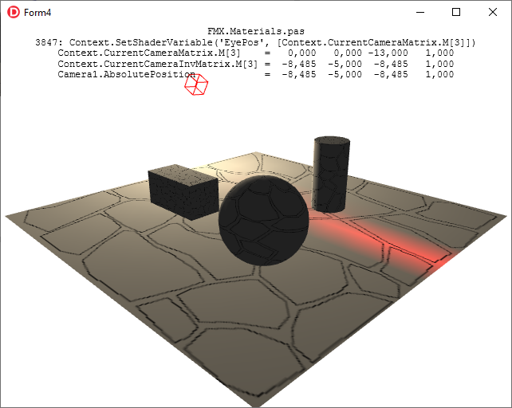

# Delphi lighting fix

I see that FMX TLightMaterial specular is not correct, as report here since 2015:
https://quality.embarcadero.com/browse/RSP-10000 
But until now (10.4.2) it has not been fixed. As screenshot below:

I think that the Camera (eye) Position is not set correct, so I look at unit FMX.Materials.pas and found this line:
procedure TLightMaterial.DoApply(const Context: TContext3D);
...
3847: Context.SetShaderVariable('EyePos', [Context.CurrentCameraMatrix.M[3]]);
But in this context, CurrentCameraMatrix.M[3] is not absolute position of current camera, as code below:
Unit FMX.Controls3D; Line 2681:

function TCamera.GetCameraMatrix: TMatrix3D;
begin
  if FTarget <> nil then
    Result := TMatrix3D.CreateLookAtDirRH(TPoint3D(AbsolutePosition), TPoint3D(AbsolutePosition) -
      TPoint3D(Target.AbsolutePosition), - TPoint3D(AbsoluteUp))
  else
    Result := TMatrix3D.CreateLookAtDirRH(TPoint3D(AbsolutePosition), - TPoint3D(AbsoluteDirection),
      - TPoint3D(AbsoluteUp));
end;

Unit System.Math.Vectors; Line 1295:

class function TMatrix3D.CreateLookAtDirRH(const ASource, ADirection, ACeiling: TPoint3D): TMatrix3D;
var
  ZAxis, XAxis, YAxis: TPoint3D;
begin
  ZAxis := ADirection.Normalize;
  XAxis := ACeiling.CrossProduct(ZAxis).Normalize;
  YAxis := ZAxis.CrossProduct(XAxis);

  ...

  Result.m41 := - XAxis.DotProduct(ASource);
  Result.m42 := - YAxis.DotProduct(ASource);
  Result.m43 := - ZAxis.DotProduct(ASource);
end;
So I copy file FMX.Materials.pas to current Project folder, modify line 3847 as below:
3847: Context.SetShaderVariable('EyePos', [Context.CurrentCameraInvMatrix.M[3]]);
Rebuild the project, and result look good:
